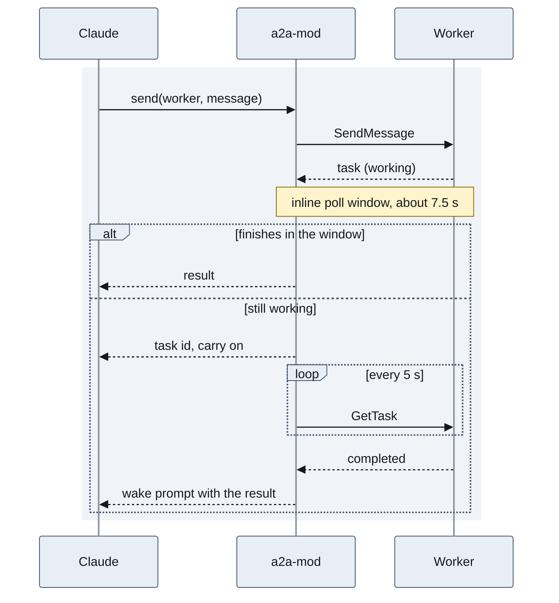

# a2a-mod

Claude hands tasks to non-Claude agents over A2A, keeps working, and picks up the results when they land.

[](https://github.com/NovusEdge/a2a-mod/actions/workflows/ci.yml)
[](LICENSE)
[](https://a2a.khimani.dev)

Docs and wiki: https://a2a.khimani.dev

<!-- demo GIF: recorded from the real mod once the UI lands -->

## Why

Claude drives. Any A2A 1.0 or 0.3 worker (ADK, AG2, LangGraph, @a2a-js/sdk and others) does the hands-on work. A slow task never blocks Claude: after a few seconds the mod tracks it in the background, and Claude gets a message when it finishes.

## Install

In Claude Code:

```
/plugin marketplace add NovusEdge/a2a-mod
/plugin install a2a-mod@a2a-mod
```

Requires Claude Code 2.1.287 or later, the first release with mods.

## Quick start

The repo ships a fake worker that echoes, waits, or asks a question back. It needs Node 24 and pnpm.

```sh
git clone https://github.com/NovusEdge/a2a-mod && cd a2a-mod
pnpm i && pnpm worker
```

The worker listens on `http://127.0.0.1:41241` (set `PORT` to change it). In Claude Code, register it:

```
/a2a add http://127.0.0.1:41241 fake
```

Then ask Claude:

```
use the fake worker
use it on slow 20 build
```

The first prompt gets an inline reply that lists the worker and its skills. The second is a task that takes 20 seconds. Claude gets a task id back after about 7 seconds and carries on. The status line shows the task, like `a2a ⠋ fake slow 20 build 0:12`. When the worker finishes, the mod wakes Claude with the result.

## Commands and tools

| Command | What it does |
| --- | --- |
| `/a2a add <url> [alias]` | Fetch the worker's Agent Card and register it. The alias defaults to a slug of the card name. Run it again to refresh a worker. |
| `--token-setting` | Take the token from the `tokens` setting. This is the default. |
| `--token-cmd "<command>"` | Take the token from a command's output. |
| `--token-file <path>` | Take the token from a file. |
| `--trust-endpoint` | Allow the token to go to an endpoint on another origin than the card. |
| `/a2a list` | Show registered workers, their skills, and running tasks with their age. |
| `/a2a remove <alias>` | Forget a worker. |

Give a worker at most one token flag. `/a2a` with no arguments opens the workers pane and prints the usage text.

Claude sees three tools:

- `workers` lists the registered workers and their skills.
- `send` sends a task to a worker. It returns the answer if the worker finishes in time, and a task id otherwise. Pass `taskId` to answer a worker that asked for input, or `contextId` to continue a conversation.
- `task` reads the full state and result of a task, or cancels it.

## Worker tokens

A worker gets a bearer token from one of three sources, chosen per worker when you add it.

The `tokens` setting holds `alias=token` pairs separated by spaces. Set it from a shell, then restart Claude Code:

```sh
claude plugin configure a2a-mod@a2a-mod --values-stdin <<< '{"tokens":"w1=<token>"}'
```

This replaces the whole setting, so list every worker in it: `"w1=<token> w2=<token>"`. `--token-cmd` runs a command without a shell and uses its output as the token:

```
/a2a add https://worker.example.com w1 --token-cmd "op read op://vault/w1/token"
/a2a add https://worker.example.com w2 --token-cmd "pass show w2"
/a2a add https://worker.example.com w3 --token-cmd "gh auth token"
```

`--token-file` reads the token from a file. Keep it at mode 0600:

```
/a2a add https://worker.example.com w4 --token-file ~/.config/a2a/w4.token
```

Command and file tokens are cached in memory for 5 minutes and fetched again after a 401 or 403.

Never type a token into Claude or into `/a2a`. Slash commands are kept in the transcript, so `/a2a add` rejects `--token`.

A token goes only to the origin of the worker's Agent Card. If the card points to an endpoint on another origin, the mod withholds the token until you re-add the worker with `--trust-endpoint`.

The `tokens` setting is stored in plain text in `~/.claude/.credentials.json` on Linux, readable only by your user. [SECURITY.md](SECURITY.md) covers where each source is kept, what counts as a vulnerability, and how to report one.

## How it works



`send` polls the worker at 0.5, 1, 2 and 4 seconds, which is the roughly 7.5 second window. A task still live after that goes into session state, and a timer polls it every 5 seconds. The status line shows the live task and its age. When a task finishes, fails or is canceled, the mod submits one prompt with the results, so Claude resumes without polling. A worker that fails 6 polls in a row is dropped, and Claude is told.

## What it doesn't do (yet)

- Streaming. The mod runtime returns a whole response body at once, so there is no SSE.
- Push notifications.
- Inbound or server mode. The mod is a client only.
- The gRPC and REST bindings. JSON-RPC only.
- OAuth flows. Workers get a bearer token.

## The look

| Piece | `full` (default) | `pane` | `minimal` |
| --- | :-: | :-: | :-: |
| Status line with the live task, `a2a ⠋ fake slow 20 build 0:12` | yes | yes | yes |
| Workers pane, opened with `/a2a`: Cancel, Open, Copy, Reply | yes | yes | no |
| Cards for `send` and for wake messages | yes | no | no |
| Hand-off band above the prompt, only while a task runs or waits | yes | no | no |

The status line is where a running task shows, because it stays visible next to `/diff`. The band is the same hand-off, one row high, and goes away about 2 seconds after the last task ends. The workers pane never opens by itself: run `/a2a`. It asks for a slim dock (32 columns), so it sits beside `/diff` as a tab, and it holds down to 24 columns.

Change the layout or turn animations off in `/config`. With animations off, every effect draws one still frame. VS Code and the mobile app draw still frames, and the mobile app has no Reply. Built and tested on Claude Code 2.1.288. More on [the UI page](https://a2a.khimani.dev/ui).

When a worker asks a question, Claude is woken as before, and the pane offers Reply too. If you answer from the pane, your next prompt tells Claude what you sent. If both of you answer, the worker gets both messages, and the row shows who answered first. A task waiting for input stays listed in the band, the pane and the status line (`a2a ? fake waiting: <question>`) until someone answers or cancels it.

## Compatibility

A2A 1.0 and 0.3 over JSON-RPC. The mod reads the version from the worker's Agent Card. It is tested end to end against @a2a-js/sdk 1.3.0. Claude Code 2.1.287 or later.

## Contributing

See [CONTRIBUTING.md](CONTRIBUTING.md).

## Security

See [SECURITY.md](SECURITY.md) to report a vulnerability.

## License

MIT. See [LICENSE](LICENSE).
