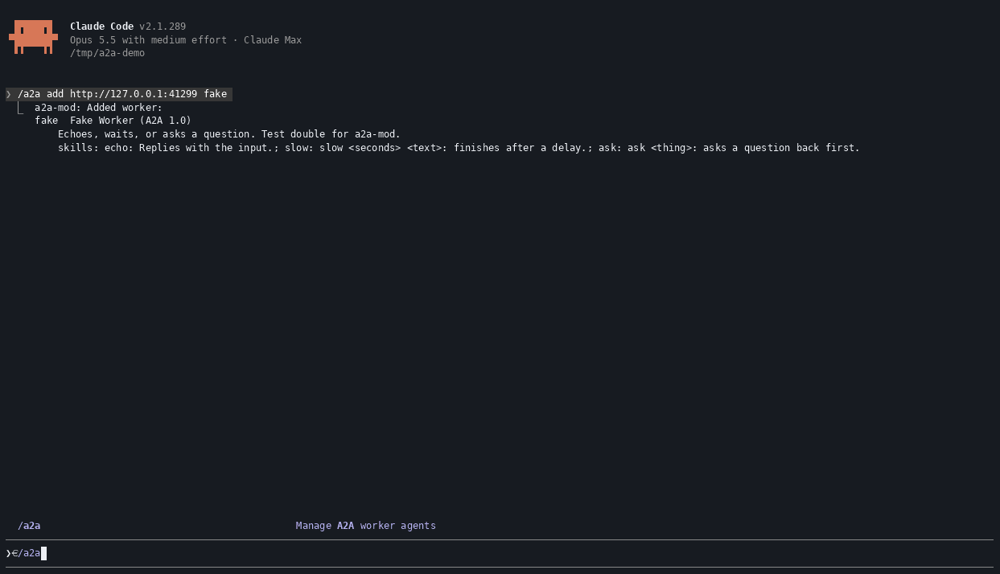
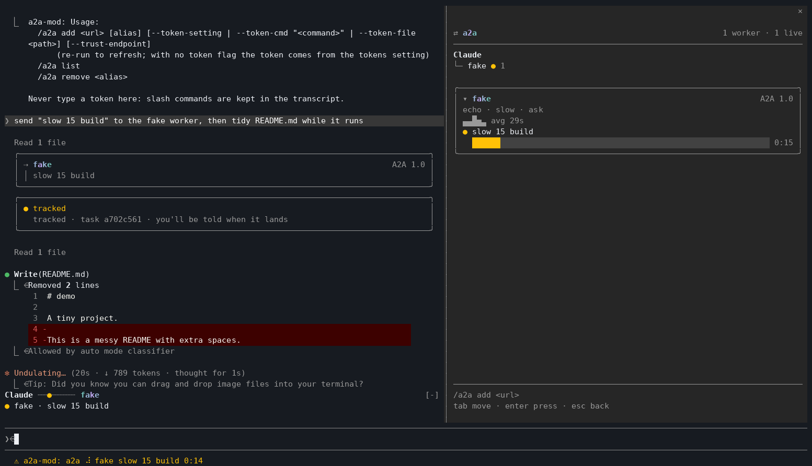
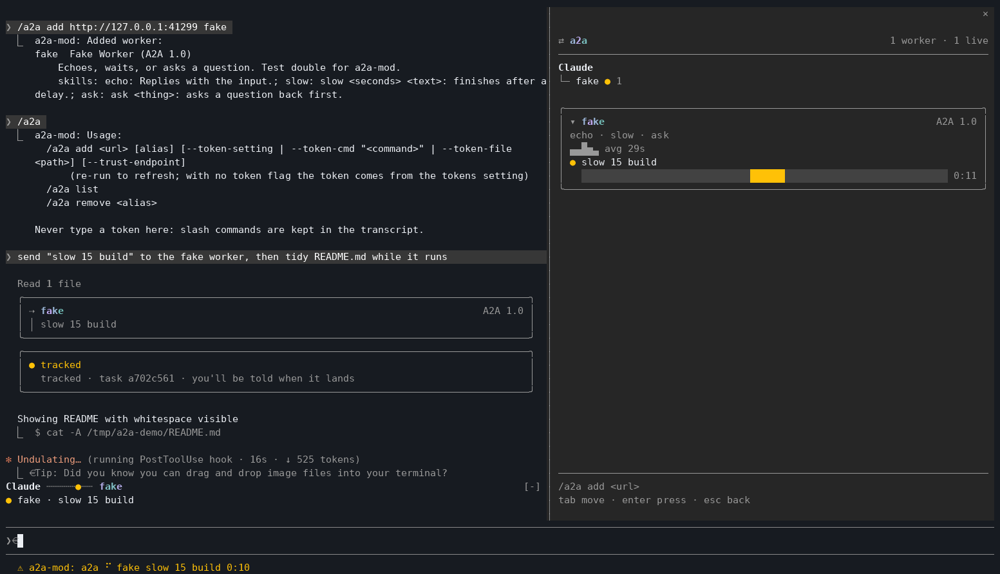
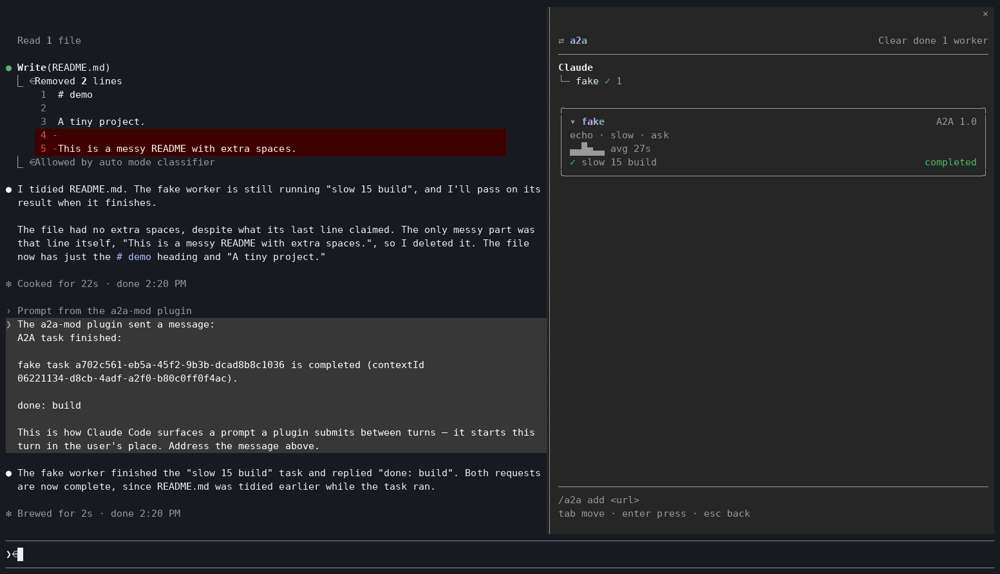
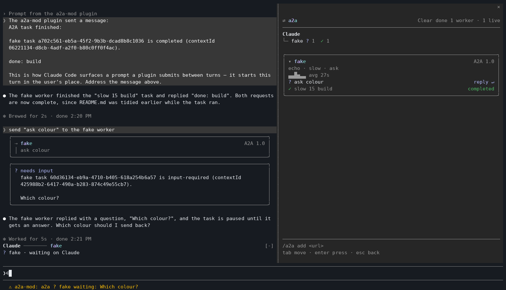

<div align="center">

# a2a-mod

**Hand work to other AI agents from Claude Code. Keep going. Get the result back.**

[](https://github.com/NovusEdge/a2a-mod/actions/workflows/ci.yml)
[](https://github.com/NovusEdge/a2a-mod/releases)
[](LICENSE)
[](https://a2a.khimani.dev/protocol)
[](https://a2a.khimani.dev)



</div>

## Why

- **Claude never waits on a slow agent.** After a few seconds the task moves to the background and Claude carries on. When the agent finishes, Claude gets the result.
- **Works with any A2A agent.** ADK, AG2, LangGraph, @a2a-js/sdk, or anything else that speaks A2A 1.0 or 0.3.
- **Your tokens stay out of the chat.** Keys come from a setting, a command or a file. You never paste one into Claude.

## Install

In Claude Code 2.1.287 or later:

```
/plugin marketplace add NovusEdge/a2a-mod
/plugin install a2a-mod@a2a-mod
```

## Try it in a minute

You don't need a real agent. The repo ships a fake worker (needs Node 24 and pnpm).

1. Start it:
   ```sh
   git clone https://github.com/NovusEdge/a2a-mod && cd a2a-mod
   pnpm i && pnpm worker
   ```
2. In Claude Code, add it:
   ```
   /a2a add http://127.0.0.1:41241 fake
   ```
3. Ask Claude:
   ```
   send "slow 20 build" to the fake worker
   ```

The task takes 20 seconds. Claude gets a task id after about 7 and moves on. When the worker is done, the mod wakes Claude with the result.

## What you'll see

- **A status line** with the live task: `a2a-mod: ⠋ fake slow 20 build 0:12`. It stays visible next to `/diff`.
- **A band above your prompt** while a task runs, showing the hand-off from Claude to the worker.
- **A slim `⇄ a2a` pane** that opens with `/a2a`, as a tab next to `/diff`. It shows each worker, its tasks, and buttons to copy a result, reply to a question or cancel.
- **Boxed cards** in the transcript for each `send` and each result.

<table align="center">
  <tr>
    <td align="center"><br><sub>A task running</sub></td>
    <td align="center"><br><sub>Cards in the transcript</sub></td>
  </tr>
  <tr>
    <td align="center"><br><sub>The result lands</sub></td>
    <td align="center"><br><sub>A worker asks a question</sub></td>
  </tr>
</table>

Pick `full`, `pane` or `minimal` in `/config` to show more or less. [The UI](https://a2a.khimani.dev/ui) has the details.

## Use your own agents

```
/a2a add https://worker.example.com research --token-cmd "pass show research"
```

The token is read from a command, a file or a setting, and never typed into Claude. [Worker tokens](https://a2a.khimani.dev/tokens) covers all three.

## Learn more

[How it works](https://a2a.khimani.dev/how-it-works) · [Write a worker](https://a2a.khimani.dev/write-a-worker) · [Troubleshooting](https://a2a.khimani.dev/troubleshooting) · [Security](https://a2a.khimani.dev/security) · [Protocol support](https://a2a.khimani.dev/protocol)

## Contributing and license

Contributions are welcome: see [CONTRIBUTING.md](CONTRIBUTING.md). To report a vulnerability, see [SECURITY.md](SECURITY.md). MIT licensed: see [LICENSE](LICENSE).
